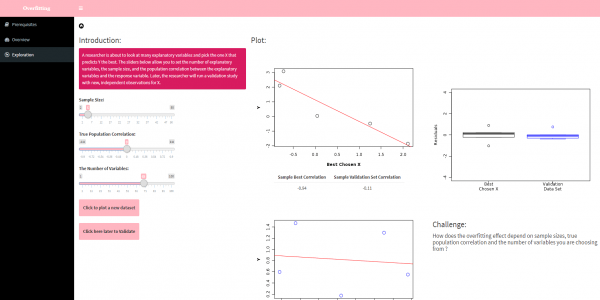

# overfitting_remake_Dakota_Daisy
Remaking overfitting app.

### What is the purpose of this app? 

This app is intended for the users to visualize and understand overfitting in machine learning or statistics. The original app is kind of confusing--their app explores how you can become overconfident when you are choosing the best explanatory variable from many choices. 

We adapted their skeleton code and made our new overfitting app. In this app, user can generate data, train the polynomial model on the training data, and test its performance on the test data. The user could clearly visualize if they increase the degree of polynomials, the training MSE will likely decrease but the test MSE might increase. It helps the user to better understand what does overfitting means through directly visualizing them on the graph. We also included a line plot with test and train mse plotted and user could compared the results.

### Explain why you made the design decisions you made in this app. How were they influenced by your understanding of the needs and of the existing alternatives.

We originally wanted to give more freedom for the user to play with -- change the data size, explore the test/train split ratio, modify the K in K fold validation, add regularization. However, we realized providing so many choices may confuse our users. For example, if the data size is large, the overfitting phenomenon might be less severe and users might be hard to spot it on the graph. If the test/train ratio is wierd, then the graph will looks wierd, and this is not the intention that we build this app for. 

Then we start to focus on one thing-- adding a slider for the user to choose the degree of polynomials. Since this is the only thing the user could control(while they could still generate new data or fit the model through action buttons), we limited their attention to this slider and the graphs on the right. In this way, they could compare and contrast the test and train mse while increasing or decreasing the degree, and also monitor the overall trend in our MSE line plot below.  

# our app Vs Boast app

### overview page: 

### instruction page:

### explore page:

### BOAST Overfitting app:

